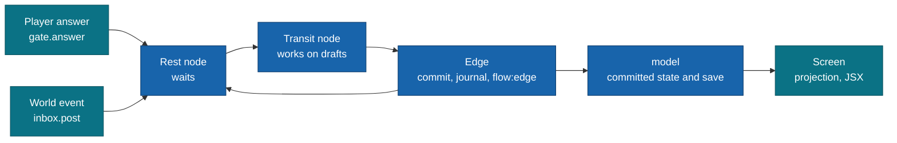
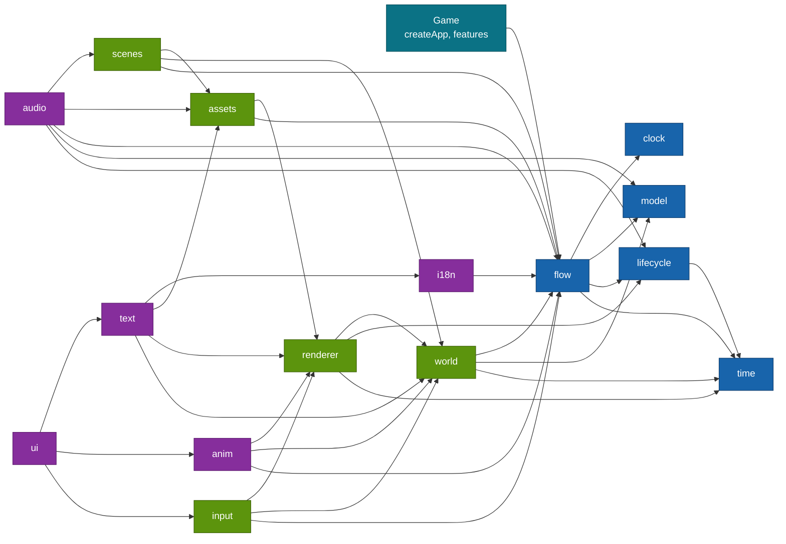

# @moku-labs/game

**A 2D puzzle game engine where the game is a deterministic graph of business logic.**

`@moku-labs/game` is a Layer-2 framework on [`@moku-labs/core`](https://github.com/moku-labs/core), written in TypeScript, with PixiJS v8 as a peer dependency. You write small nodes and edge tables. The engine runs them, commits state on the edges, saves at rest points and replays the same game without a screen. It is not a general-purpose engine and it ships no genre rules: no match-3, no merge, no physics. V1 is the logic half; V2 adds the screen: an own small ECS, projections from committed state, a Pixi v8 renderer loaded lazily, gestures as data components, typed asset keys and scenes as declarations. V3 adds the interface: choreographies as data, strings as data, text from MSDF fonts, screens written in JSX and laid out by Yoga, and sound as an effect a node awaits.

<br/>

[](#status)
[](#requirements)
[](#requirements)
[](#requirements)
[](https://github.com/moku-labs/core)
[](./LICENSE)

<br/>

[Why](#why-moku-labsgame) · [Status](#status) · [Install](#install) · [Quick start](#quick-start) · [How it works](#how-it-works) · [Plugins](#plugins) · [Interface in JSX](#interface-in-jsx) · [Events](#events) · [Configuration](#configuration) · [Development](#development) · [Requirements](#requirements) · [Docs](#docs)

---

## Why @moku-labs/game

- **The game is a graph.** Flows are edge tables, nodes are small functions with plain `await` bodies. Exactly one node is active at any time.
- **State commits only on edges.** A node works on drafts. The runner commits them when the node returns an outcome. A node that throws changes nothing.
- **Position is data.** Node path, input and state describe the whole game. That gives checkpoints, rollback, bookmarks, fast walk and repro runs.
- **Input and world events are answers.** A rest node waits. A player answer comes through the gate, a world event comes through the inbox. Nothing else moves the graph.
- **The screen is a projection, not the game.** Rendering reads committed state and never owns it. A projection is one pure `view(item)` function; the engine diffs the components and plays enter, exit, change and settle motions. The same game plays whole headless.
- **Deterministic by construction.** Time is an input named `now`. Randomness is a persisted `rng` stream. Lint rule L3 refuses `Date.now` and `Math.random` in the logic set.

## Status

V1, V2 and V3 are built. Everything below V3 is a plan and may change.

| Milestone | State | Scope | Exit criterion |
|---|---|---|---|
| V1 | built | `time`, `lifecycle`, `model`, `clock`, `flow`, the `@moku-labs/game/testing` entry | A fixture game is played to the end headless |
| V2 | built | `world`, `renderer`, `input`, `assets`, `scenes`, the `@moku-labs/game/assets` entry | A board is visible and items merge by drag; the same game still plays to the end headless |
| V3 | built | `anim`, `i18n`, `text`, `ui`, `audio`, the `@moku-labs/game/jsx-runtime` entry | Popup, HUD and buttons with sound; the same game still plays to the end headless |
| V4 | planned | `/inspect` and `/control` entries | External tools can read and drive a game |
| V5 | planned | `effects`, production mode of `assets`, visual test helpers | Not defined yet |
| V6 | planned | `platform` | A template game runs on a phone |

Rendering: WebGPU is preferred, with Pixi's WebGL fallback and an honest "unsupported device" screen when neither exists.

## Install

```sh
bun add @moku-labs/game pixi.js
```

> [!NOTE]
> **Status: `0.0.0`, not published yet.** The package is not on npm. The command above is the intended install line. `pixi.js` `^8.0.0` is a peer dependency. No V1 code imports it.

> [!IMPORTANT]
> Bun only. ESM only. `"sideEffects": false`. There is no CJS build. `yoga-layout` is a dependency the `ui` plugin loads lazily; nothing imports it before `onStart`.

## Quick start

A tiny dice game: one rest node, two transit nodes, one flow.

**1. Bind the helpers to the types of the game.** `defineNode` and `defineFlow` come from `defineGame`. They are not root exports.

```ts
// state.ts
import { defineGame } from "@moku-labs/game";

export type Player = { coins: number; lastRoll: number };
export type Session = { rolls: number };

export const { defineNode, defineFlow, defineFeature } = defineGame<{
  player: Player;
  session: Session;
  assets: string;
  strings: Record<string, unknown>;
}>();
```

**2. Write the nodes.** A rest node without a body is a pure wait. The intent of the answer names the outcome.

```ts
// nodes.ts
import { type } from "@moku-labs/game";
import { defineNode } from "./state";

export const home = defineNode({
  outcomes: { roll: type(), reset: type() },
  rest: true,
  checkpoint: true
});

export const roll = defineNode({
  outcomes: { done: type() },
  run: ({ player, session, rng, out }) => {
    const face = rng.stream("dice").range(1, 6);

    player.coins += face;
    player.lastRoll = face;
    session.rolls += 1;
    return out.done();
  }
});

export const reset = defineNode({
  outcomes: { done: type() },
  run: ({ player, out }) => {
    player.coins = 0;
    return out.done();
  }
});
```

**3. Wire the flow.** The edge table is checked by the compiler. A missing edge or an unknown target is a compile error with a sentence.

```ts
// flow.ts
import { defineFlow } from "./state";
import { home, reset, roll } from "./nodes";

export const mainFlow = defineFlow("main", {
  nodes: { home, roll, reset },
  start: "home",
  edges: {
    home: { roll: "roll", reset: "reset" },
    roll: { done: "home" },
    reset: { done: "home" }
  }
});
```

**4. Create the app.** The graph is started by the game, never by the plugin.

```ts
// game.ts
import { createApp } from "@moku-labs/game";
import { mainFlow } from "./flow";

export const createGame = (seed: "from-save" | number = "from-save") =>
  createApp({
    pluginConfigs: {
      model: { initialPlayer: { coins: 0, lastRoll: 0 }, initialSession: { rolls: 0 }, seed },
      flow: { mainFlow, safeNode: "home" }
    },
    onStart: ctx => {
      ctx.flow.run().catch((error: unknown) => {
        ctx.log.error("game: the graph failed", { error });
      });
    }
  });
```

A hook that throws never stops the game. The engine writes it to the log as the error entry `"game: a hook failed"`; read it with `app.log.trace()`. A game can add its own `onError: (error, ctx) => …` to `createApp`; the kernel calls both.

**5. Play it headless.** `createHeadless` returns a game object once the graph rests at its first
rest node. Its `walk` method plays a route.

```ts
// game.test.ts
import type { Flow } from "@moku-labs/game";
import { createHeadless } from "@moku-labs/game/testing";
import { expect, it } from "vitest";
import { createGame } from "./game";

const rollOnce: Flow.RouteStep = { at: "home", intent: "roll" };

it("plays two rolls and a reset without a screen", async () => {
  const app = createGame(42);
  const game = await createHeadless(app);

  const state = await game.walk([rollOnce, rollOnce]);

  expect(state.path).toBe("home");
  expect(app.model.store.snapshot().session).toEqual({ rolls: 2 });

  await game.walk([{ at: "home", intent: "reset" }]);

  expect(app.model.store.snapshot().player).toMatchObject({ coins: 0 });

  await game.stop();
});
```

In a live game the same answer comes from the screen: `app.flow.gate.answer({ intent: "roll" })`.

> [!TIP]
> Types reach a game through one namespace per plugin: `import type { Flow, Model, Clock, Lifecycle, Time } from "@moku-labs/game"`, then `Flow.RouteStep`, `Model.PlayerStateProvider`, `Time.Phase`. The screen and interface plugins follow the same rule: `World`, `Renderer`, `Input`, `Assets`, `Scenes`, `Anim`, `I18n`, `TextTypes`, `Ui`, `Audio`. `Text` is the component, so its type namespace is `TextTypes`.

> [!TIP]
> A larger worked example lives in [`tests/integration/merge-game/`](./tests/integration/merge-game). It is a small game written on the public API only, with sub-flows, a slot, a feature and timers. It is an internal test fixture and is not published. Its scenario is [`tests/integration/template-merge.test.ts`](./tests/integration/template-merge.test.ts).

## How it works



### The contract

| Term | Meaning |
|---|---|
| Node | `defineNode({ input?, outcomes, run })`. The body gets one context object and returns `out.name(data)`. |
| Node context | `{ input, player, session, rng, fx, out, signal, now }`. `player` and `session` are drafts. `now` is `clock.now()` read once at node entry. |
| Rest node | `rest: true`. The graph waits here. Without `run` it is a pure wait for a gate answer or an inbox event. Entering it marks a rest point. |
| `checkpoint` | A rest node where the journal is compacted. `safeNode` points at one. |
| `barrier` | After the edge of this node the save is written durably with `commitDurable`. Rollback cannot cross it. Every edge of a barrier node leads to a rest node of the same flow. |
| `over` | The node waits while a pointer is down, so a popup never appears in the middle of a drag. |
| `inbox` | Outcome names of a rest node that a world event of the same type may produce. |
| Flow | `defineFlow(id, { nodes, start, edges, input?, outcomes? })`. A flow with `outcomes` is used as a node of another flow. |
| Edge target | A node name, `exit("outcome")` to leave a sub-flow, or `to("node", payload => input)` to adapt the payload. |
| Slot | `slot("name")`. An extension point. Features contribute sub-flows to it with an `order`. |
| Feature | `defineFeature(name, { nodes?, flows?, contribute? })`. An ordinary plugin that registers into `flow.features`. `feature.logicOnly` is the headless twin. |
| Effect | `await fx(descriptor)` for awaited effects, `fx.emit(hint(kind, payload))` for cosmetic ones. Hints are released after the commit and dropped in fast mode. |
| Transition | Rest node to rest node. It is a transaction. An error rolls back to the last rest point, retries, then enters `safeNode`. |

## Plugins

Five logic plugins are on every app; the nine screen plugins are the list `screen` a game spreads in; `audio` is opt-in, `[...screen, audioPlugin]`. `log` and `env` come from [`@moku-labs/common`](https://github.com/moku-labs/common) and sit on every plugin context as `ctx.log` and `ctx.env`.

### Built

| Plugin | Tier | Owns | Key API |
|---|---|---|---|
| [`time`](./src/plugins/time/README.md) | Standard | The single `requestAnimationFrame` loop, six frame phases, the `Time` resource | `onFrame(phase, callback)`, `snapshot()`, `setScale(scale)`, `pause()`, `resume()`, `isPaused()`, `isRunning()`, `step(deltaMs)` |
| [`lifecycle`](./src/plugins/lifecycle/README.md) | Standard | The stack of pause reasons. Pauses `time` by a direct call | `push(reason)`, `pop(reason)`, `reasons()`, `isPaused()` |
| [`model`](./src/plugins/model/README.md) | Very Complex | The `session` tree and the save document `{ player, rng }`, transactions, rest-point rollback, rng streams | `store.load()`, `store.snapshot()`, `store.begin()`, `store.markRest()`, `store.markBarrier(txId)`, `store.rollback()`, `store.restore(input)`, `store.flush()`, `rng.peek(id)` |
| [`clock`](./src/plugins/clock/README.md) | Standard | Trusted time as an input: monotonic `now()` and one `elapsed` signal at the next due moment | `now()`, `scheduleAt(moment)`, `onElapsed(listener)`, `poke()`, `dueAt()` |
| [`flow`](./src/plugins/flow/README.md) | Very Complex | The graph: runner, gate, inbox, effects gateway, features registry | `run()`, `onEnter(stage, callback)`, `walk(route, options?)`, `bookmark()`, `restore(bookmark)`, `describe()`, `state()`, `history()`, `setMode(mode)`, `gate.answer(answer)`, `gate.pointer(active)`, `gate.state()`, `inbox.post(event)`, `fx.handle(kind, handler, options?)`, `fx.dispatch(descriptor)`, `features.register(name, description)`, `features.all()`, `features.contributions(slotName)` |
| [`world`](./src/plugins/world/README.md) | Very Complex | A zero-dependency ECS (`ecs`) and the projection from committed state to entities (`projection`): keyed reconcile of one `view(item)` function, retarget motions, a despawn queue, named layers | `ecs.spawn(owner, components)`, `ecs.query(...Components)`, `ecs.system(def)`, `ecs.set(entity, Component, patch)`, `ecs.changed(Component)`, `ecs.snapshot()`, `ecs.mode()`, `projection.mount(names, owner)`, `projection.setLayers(list)`, `projection.settle(entity)`, `projection.keyOf(entity)`, `projection.entityOf(projection, key)` |
| [`renderer`](./src/plugins/renderer/README.md) | Very Complex | The Pixi v8 host loaded lazily (`host`), one `sync` system that owns every display object, the reference viewport of short side 1080 (`viewport`) | `host.ready()`, `host.kind()`, `host.canvas()`, `sync.hitTest(x, y, accept)`, `sync.textures.provide(fn)`, `sync.displayOf(entity)`, `viewport.toReference(x, y)`, `viewport.size()` |
| [`input`](./src/plugins/input/README.md) | Standard | Gestures as data components: `Tappable`, `Pressable`, `Draggable`, `DropTarget`, `Swipeable`; the drop target names the intent that reaches `flow.gate` | `tap(target)`, `press(target)`, `drag(from, to)`, `swipe(target, direction)` |
| [`assets`](./src/plugins/assets/README.md) | Complex | The manifest, five load tiers, graph-driven preload, a texture budget with LRU unload; typed keys from the `assets` entry | `load(bundle)`, `unload(bundle)`, `isLoaded(bundle)`, `texture(key)`, `usage()` |
| [`scenes`](./src/plugins/scenes/README.md) | Standard | A scene as a declaration: bundle, layers, projections, `music`. A node names its scene; the runner switches through `flow.onEnter` | `current()` |
| [`anim`](./src/plugins/anim/README.md) | Complex | The one tween core, installed into `world.projection` as the `TweenDriver`; timelines as frozen data built from typed slots; `defineMotion` sugar for the enter, exit and change hooks | `play(animation, slots)`, `finishAll()`, `active()`, `onMark(fn)` |
| [`i18n`](./src/plugins/i18n/README.md) | Complex | Strings as data: `tr(key, params)` is a `Message`, ICU MessageFormat compiled to plain functions by `compileStrings` on the `assets` door, `Part[]` at run time, never a joined string | `locale()`, `setLocale(locale)`, `format(message, locale?)`, `plain(message)`, `has(key)`, `locales()` |
| [`text`](./src/plugins/text/README.md) | Complex | The `Text` component, `label()`, `defineTextStyles()`, the tags `<b> <i> <color=#hex> <icon=key>`, measurement from the font's advance table, BitmapText from the MSDF fonts of a bundle | `measure(content, style)`, `styles()` |
| [`ui`](./src/plugins/ui/README.md) | Very Complex | A screen is a projection whose `view` returns JSX; the tree is reconciled by identity into entities, laid out by one Yoga solve per change, `Box` is the rest pose; `defineComponent` with `local` and `outcomes`, `popup` as an effect, `defineStyle`, `defineTokens` | `tree()`, `find(key)`, `lint()` |
| [`audio`](./src/plugins/audio/README.md) | Standard | Opt-in. Buses `master`, `music`, `sfx`; `sfx()` descriptors of `anim` and `music()` descriptors handled here; the scene's `music`; volumes read from the committed player through `volumes` | `setVolume(bus, value)`, `volume(bus)`, `mute(bus, on)`, `unlocked()` |



An arrow means "depends on"; for the V3 plugins the edges to `time` and the edges a nearer plugin already implies are left out for space, the plugin READMEs list them in full. `time`, `model` and `clock` depend on nothing. The logic plugins are registered in this order: `time`, `lifecycle`, `model`, `clock`, `flow`; the screen set `screen` follows as `world`, `renderer`, `input`, `assets`, `scenes`, `anim`, `i18n`, `text`, `ui`; a game that wants sound appends `audioPlugin`. Without a document the screen plugins are inert: the same app starts in plain Bun, Yoga included.

### Planned

Not built. Names are reserved: `defineFeature` refuses them as feature names. Scope and tiers come from the plan and may change.

| Plugin | Milestone | Tier | Depends on | Will own |
|---|---|---|---|---|
| `effects` | V5 | Complex | `flow`, `world`, `renderer` | Particles, filters, frames |
| `platform` | V6 | Standard | `lifecycle`, `flow` | The native provider: background, system dialogs |

### Root exports

| Export | Kind | Purpose |
|---|---|---|
| `createApp` | function | Creates a game application |
| `createPlugin` | function | Creates a game plugin bound to the engine's config and events |
| `defineGame` | function | Returns the authoring helpers typed with the game's `player`, `session`, `assets`, `bundles`, `strings` and `textStyles`: `defineNode`, `defineFlow`, `defineFeature`, `projection`, `sprite`, `Sprite`, `NineSlice`, `defineBundles`, `load`, `defineScene`, and from V3 `tr`, `label`, `defineTextStyles`, `defineComponent`, `defineStyle`, `defineTokens`, `popup`, `defineAnimation`, `frames`, `sfx`, `play`, `music` |
| `defineFeature` | function | Turns a feature description into a plugin. V3 keys: `projections`, `animations`, `ui`, `strings`, `textStyles` |
| `type`, `exit`, `to`, `slot` | functions | Type tag of a payload, and the three graph helpers for edge targets and slots |
| `schedule`, `guide`, `hint` | functions | Effect descriptors: next due moment, tutorial narrowing of the gate, cosmetic hint |
| `SaveUnreadableError` | class | Thrown by `model.store.load()` when the save cannot be read |
| `component`, `tag`, `resource`, `mut`, `system`, `projection`, `Layer`, `Order`, `Exiting`, `Tree` | functions and components | The ECS vocabulary of `world` and the projection helper |
| `Transform`, `Sprite`, `NineSlice`, `Shape`, `Parent`, `Display`, `sprite` | components | The display components of `renderer` |
| `Tappable`, `Pressable`, `Draggable`, `DropTarget`, `Swipeable`, `Touchable`, `Held`, `Hovered`, `Pressed`, `Pointer` | components | Gestures as data, from `input` |
| `defineBundles`, `load`, `defineScene` | functions | Bundle and scene declarations |
| `defineAnimation`, `sequence`, `parallel`, `stagger`, `tween`, `set`, `wait`, `mark`, `frames`, `sfx`, `haptic`, `use`, `play`, `external`, `defineMotion`, `Animation` | functions and a component | Choreography as frozen data. `play(animation, slots)` is the effect a node awaits; `sfx` and `haptic` are descriptors `audio` and `platform` handle; `external` throws until Spine arrives |
| `tr` | function | `tr(key, params?)` builds a frozen `Message`; no locale is read at the call site |
| `Text`, `label`, `defineTextStyles` | component and functions | Words on the screen and the text styles a feature registers |
| `defineComponent`, `popup`, `defineStyle`, `defineTokens`, `resolve`, `Box`, `LocalWrite` | functions and components | Interface components, the popup effect, the style vocabulary, the rect of an element |
| `music` | function | `music(key \| null, { fadeMs? })`, the awaited effect that switches the music track |
| `timePlugin`, `lifecyclePlugin`, `modelPlugin`, `clockPlugin`, `flowPlugin`, `worldPlugin`, `rendererPlugin`, `inputPlugin`, `assetsPlugin`, `scenesPlugin`, `animPlugin`, `i18nPlugin`, `textPlugin`, `uiPlugin`, `audioPlugin` | plugin instances | For `depends` and `ctx.require` in game plugins; `screen` is the list of the nine screen plugins |
| `Time`, `Lifecycle`, `Model`, `Clock`, `Flow`, `World`, `Renderer`, `Input`, `Assets`, `Scenes`, `Anim`, `I18n`, `TextTypes`, `Ui`, `Audio` | type namespaces | All public types of one plugin |

### Other entries

| Entry | Runs in | Exports |
|---|---|---|
| `@moku-labs/game/testing` | anywhere | The headless helpers, see below |
| `@moku-labs/game/assets` | node and bun only | `scanAssets`, `emitKeys`, `emitManifest`, `compileStrings`, `checkStrings`, `runCli`. A game runs it as `bun run assets:keys`: it writes the manifest, the typed asset keys and, next to them, `generated/strings.ts` with one `strings.<locale>.ts` per locale; `--check` fails when any of them is out of date |
| `@moku-labs/game/jsx-runtime`, `@moku-labs/game/jsx-dev-runtime` | anywhere | `jsx`, `jsxs`, `jsxDEV`, `Fragment` and the `JSX` namespace that `"jsxImportSource": "@moku-labs/game"` resolves to. A game never imports them by hand |

### Testing entry

`@moku-labs/game/testing` re-exports the headless helpers.

| Export | Signature | Purpose |
|---|---|---|
| `createHeadless` | `(app: HeadlessApp) => Promise<HeadlessGame>` | Sets flow mode `"fast"`, starts the app, starts `flow.run()` unless the app already did, and waits for the first rest point |
| `runRepro` | `(app: HeadlessApp, repro: Repro) => Promise<ReproResult>` | Restores a state and a checkpoint, then walks a route |
| `stepFrames` | `(app: HeadlessApp, count: number, deltaMs: number) => void` | Calls `app.time.step(deltaMs)` `count` times |
| `fakeClock` | `(start = 0) => FakeClock` | A `ClockSource` with `advance(ms)` and `set(moment)` |
| `memory` | `(fixture?: { state: SaveDoc; version: number }) => PlayerStateProvider & { calls: ProviderCall[] }` | In-memory save provider. It keeps what it was committed and records every call |
| `saveOf` | `(player: Json, seed?: number) => SaveDoc` | Builds a save document for a fixture |

A `HeadlessGame` has `walk(route)`, `answer(answer)`, `state()`, `history()` and `stop()`.

## Interface in JSX

The interface is one more projection. A screen is a projection whose `view` returns JSX; `ui` reconciles the tree by identity into entities it owns and lays them out with one Yoga solve per change. There is no DOM and no React: the runtime builds plain description nodes, and `"jsxImportSource": "@moku-labs/game"` is the only setup.

```jsonc
// tsconfig.json of the game
{ "compilerOptions": { "jsx": "react-jsx", "jsxImportSource": "@moku-labs/game" } }
```

The tags are `screen`, `layer`, `row`, `column`, `stack`, `spacer`, `panel`, `image`, `icon`, `text`, `button` and `scroll`. A `button` either names an `intent` for the gate or writes `local` state of its nearest component, never both. A `text` takes a string or a `Message` from `tr`; its size comes from a text style key, not from the layout style.

```tsx
// features/hud/view.tsx — the HUD, a reward popup and the choreography they share
import type { Anim } from "@moku-labs/game";
import { Transform, mark, parallel, sequence, sfx, tween, type } from "@moku-labs/game";
import { defineAnimation, defineComponent, defineFeature, defineTextStyles, projection, tr } from "../../state";

export const hud = projection({
  name: "hud",
  layer: "ui",
  from: player => ({ coins: player.coins }),
  view: hud => (
    <row key="bar" style={{ gap: 16, padding: { top: "safeArea.top", left: 24, right: 24 }, width: "100%", height: 120 }}>
      <text key="coins" style="hud.digits" content={tr("hud.coins", { n: hud.coins })} />
      <button key="settings" intent="openSettings" style={{ width: 96, height: 96 }}>
        <icon name="hud.gear" />
      </button>
    </row>
  )
});

export const RewardPopup = defineComponent("RewardPopup", {
  outcomes: { claim: type<{ orderId: string }>() },
  view: (props: { orderId: string; gold: number }) => (
    <panel key="reward" nineSlice="ui.panel" style={{ direction: "column", gap: 16, padding: 32, width: 600, height: 400 }}>
      <text key="title" content={tr("orders.complete")} />
      <text key="gold" style="hud.digits" content={String(props.gold)} />
      <button key="claim" intent="claim" payload={{ orderId: props.orderId }} style={{ width: 240, height: 88 }}>
        <text content={tr("common.claim")} />
      </button>
    </panel>
  )
});

export const popCoins = defineAnimation("hud.popCoins", {
  slots: { coins: type<Anim.Target>() },
  build: ({ coins }) =>
    sequence(
      tween(coins, Transform, { scale: 1.2 }, { ms: 120 }),
      parallel(tween(coins, Transform, { scale: 1 }, { ms: 200, ease: "outCubic" }), sfx("hud.coins")),
      mark("done")
    )
});

export const hudFeature = defineFeature("hud", {
  projections: [hud],
  ui: [RewardPopup],
  animations: [popCoins],
  textStyles: defineTextStyles({ "hud.digits": { font: "ui.font-digits", size: 40, fill: 0xffe082, digits: true } }),
  strings: { en: () => import("../../generated/strings.en") }
});
```

A popup is an effect. The node awaits it, the gate opens for the outcomes of the component, and the promise resolves with the intent of the button the player pressed. The choreography is played the same way.

```ts
// features/orders/deliver.ts
import { play, sfx, type } from "@moku-labs/game";
import { defineNode, popup } from "../../state";
import { popCoins, RewardPopup } from "../hud/view";

export const deliver = defineNode({
  outcomes: { claimed: type<{ orderId: string }>() },
  run: async ({ player, fx, out }) => {
    fx(sfx("orders.complete"));
    const answer = (await fx(popup(RewardPopup, { orderId: "o1", gold: 5 }))) as { intent: "claim"; payload: { orderId: string } };

    player.coins += 5;
    await fx(play(popCoins, { coins: { projection: "hud", key: "coins" } }));
    return out.claimed({ orderId: answer.payload.orderId });
  }
});
```

Headless the same node runs to the end: `popup` resolves through the gate, `play` finishes at once in fast mode, and `sfx` without `audio` resolves `undefined`. The strings behind `tr` come from `features/*/strings/<locale>.json`; `bun run assets:keys` compiles them next to the asset keys, and `strings: Strings` in `defineGame` makes a wrong key or a missing parameter a compile error.

```ts
// game.ts — sound is opt-in, the buses follow the committed player
createApp({
  plugins: [...screen, audioPlugin, hudFeature],
  pluginConfigs: {
    renderer: { mount: "#game" },
    audio: { volumes: player => (player as Player).settings.audio }
  }
});
```

`volumes` receives the committed player as `Json`, so the game names its own type once. `player.settings.audio` is `{ master?, music?, sfx? }`, committed by a settings node like any other state and applied on every `model:committed`.

> [!TIP]
> `app.ui.tree()` answers the live screen as plain data, `app.ui.find(key)` the entity of a keyed element, and `app.ui.lint()` the tap targets under `tapTargetPt`, the text that overflows in some locale and the absolute elements without a `reason`. The example app of the `ui` tests, [`src/plugins/ui/__tests__/app.tsx`](./src/plugins/ui/__tests__/app.tsx), is a whole HUD with a settings component, a scrolling list and a popup, run in plain Bun.

## Events

Global events are empty: every event belongs to a plugin. `time` and `clock` emit nothing.

| Event | Emitted by | Payload | When |
|---|---|---|---|
| `lifecycle:changed` | `lifecycle` | `{ reason: PauseReason; action: "push" \| "pop"; reasons: readonly PauseReason[]; paused: boolean; resumed: boolean }` | The pause stack really changed. `resumed` is true only on the change that emptied the stack |
| `model:committed` | `model` | `{ roots: readonly Root[]; cause: "edge" \| "rollback" \| "restore" \| "load" }` | Committed state changed. `Root` is `"player" \| "session" \| "rng"` |
| `flow:edge` | `flow` | `{ flow: string; node: string; outcome: string; payload: Json; next: string; patches: { doc: Patch[]; session: Patch[] }; index: number; now: number }` | After the commit of an edge |
| `flow:rest` | `flow` | `{ path: string; checkpoint: boolean }` | The graph entered a rest node |
| `flow:error` | `flow` | `{ path: string; error: unknown; rolledBackTo: string; retry: boolean }` | A node failed and the graph rolled back |
| `world:reconciled` | `world` | counts per reconcile | Dev only, behind `reconciledEvent` |
| `renderer:device-lost` | `renderer` | `{ kind, reason }` | The GPU device or context was lost; `lifecycle` is pushed |
| `assets:bundle-loaded`, `assets:bundle-unloaded` | `assets` | `{ bundle, tier, mb, reason }` | A bundle entered or left memory |
| `scenes:changed` | `scenes` | `{ from, to, music }` | The scene switched on entering a node |
| `anim:mark` | `anim` | `{ animation, mark }` | A `mark` step was reached, or jumped by `finish()` |
| `anim:finished` | `anim` | `{ animation }` | A timeline ended or was finished. Never on `cancel()` |
| `i18n:locale-changed` | `i18n` | `{ locale }` | The module of the new locale is loaded; `text` re-resolves. Never at start |

`text`, `ui` and `audio` emit nothing.

```ts
import { createPlugin, flowPlugin } from "@moku-labs/game";

export const edgeLog = createPlugin("edgeLog", {
  depends: [flowPlugin],
  hooks: ctx => ({
    "flow:edge": payload => {
      ctx.log.info("edge", { node: payload.node, outcome: payload.outcome });
    }
  })
});
```

## Configuration

### Global

```ts
createApp({ config: { orientation: "landscape", referenceSide: 1080 } });
```

| Key | Type | Default | Meaning |
|---|---|---|---|
| `orientation` | `"portrait" \| "landscape"` | `"portrait"` | Screen orientation the game is designed for |
| `referenceSide` | `number` | `1080` | Short side of the reference resolution in pixels |

### Per plugin

Set with `createApp({ pluginConfigs: { <plugin>: { ... } } })`.

| Plugin | Key | Type | Default | Meaning |
|---|---|---|---|---|
| `time` | `maxFps` | `30 \| 60 \| 120` | `60` | Frame rate cap |
| `time` | `maxDeltaMs` | `number` | `50` | Upper bound of one frame's delta in milliseconds |
| `time` | `idleFps` | `0 \| 30` | `30` | Frame rate cap of an idle screen. `0` turns the idle cap off. Any plugin lifts it with `wake()` |
| `time` | `idleAfterMs` | `number` | `2000` | Unscaled milliseconds without a `wake()` after which the loop drops to `idleFps` |
| `lifecycle` | none | | | The plugin has no config |
| `model` | `playerProvider` | `PlayerStateProvider \| undefined` | `undefined` | The save seam. `undefined` means an in-memory provider: the save lives as long as the app does |
| `model` | `initialPlayer` | `Json` | `{}` | Player state of a new player. Deep-cloned |
| `model` | `initialSession` | `Json` | `{}` | Session state at every start. Deep-cloned |
| `model` | `seed` | `"from-save" \| number` | `"from-save"` | `"from-save"`: a new player gets a random seed once. A number fixes it for tests |
| `model` | `schemaVersion` | `number` | `1` | Version of the save schema this build writes |
| `model` | `migrations` | `readonly Migration[]` | `[]` | Ordered chain. `up` of `from: n` produces version `n + 1` |
| `clock` | `source` | `ClockSource \| undefined` | `undefined` | Time source. `undefined` means the system source. Tests pass `fakeClock()` |
| `flow` | `mainFlow` | `AnyFlow \| undefined` | `undefined` | The top-level flow. Required before `run()` |
| `flow` | `safeNode` | `string \| undefined` | `undefined` | Path of the checkpoint entered after a failed retry. `undefined` means the main flow's `start` |
| `flow` | `retries` | `number` | `1` | Retries of a failed transition before `safeNode` |
| `flow` | `settleTimeoutMs` | `number` | `2000` | How long `onStop` waits for the active node to settle after abort |
| `flow` | `journalLimit` | `number` | `500` | Journal entries kept between checkpoints |
| `world` | `settleMs` | `number` | `350` | Length of the default settle motion |
| `world` | `reconciledEvent` | `boolean` | `false` | Emit `world:reconciled` after every reconcile (dev tools) |
| `renderer` | `mount` | `string \| undefined` | `undefined` | Selector of the mount element. `undefined` keeps the renderer inert |
| `renderer` | `preference` | `"webgpu" \| "webgl"` | `"webgpu"` | Preferred backend; Pixi falls back to WebGL |
| `renderer` | `background`, `antialias`, `maxResolution`, `aspect`, `poolLimit`, `unsupportedMessage`, `loadPixi` | | see the plugin README | Host, viewport and pool settings; `loadPixi` is the lazy loader, a test passes a fake |
| `input` | `tapSlopPx`, `longPressMs`, `dragStartPx`, `swipeMinPx`, `swipeMaxMs` | `number` | `12`, `450`, `8`, `48`, `300` | Gesture thresholds in reference px and ms |
| `assets` | `manifest` | `string \| Manifest \| undefined` | `undefined` | Manifest URL, or the parsed file in a test |
| `assets` | `textureBudgetMb` | `number` | `192` | Texture memory budget for the LRU unload |
| `assets` | `preloadDepth` | `number` | `2` | Graph edges walked for the preload at a rest node |
| `assets` | `baseUrl`, `io` | | `undefined` | The CDN seam and the fetch/decode/texture seam a test replaces |
| `anim` | `maxTracks` | `number` | `2000` | Dev guard: one warning each time the running track count rises past it. Durations live in the steps, never here |
| `i18n` | `locale` | `string` | `"en"` | The locale at start |
| `i18n` | `fallback` | `string` | `"en"` | The locale a missing key is read from before it is reported missing |
| `i18n` | `locales` | `Record<string, module \| loader>` | `{}` | Compiled modules outside features, per locale |
| `text` | `fonts` | `{ body, digits }` | `{ body: "ui.font-body", digits: "ui.font-digits" }` | The two boot fonts behind the built-in styles `body` and `digits` |
| `text` | `missingGlyph` | `string` | `"□"` | Drawn for a glyph the font lacks |
| `ui` | `tapTargetPt` | `number` | `44` | The smallest tap target `lint()` accepts |
| `ui` | `breakpoints` | `{ tall, wide }` | `{ tall: 2, wide: 1.5 }` | Aspect thresholds of the `when` style variants |
| `audio` | `buses` | `{ master, music, sfx }` | `{ master: 1, music: 0.6, sfx: 1 }` | Start gain of each bus, 0..1 |
| `audio` | `musicFadeMs` | `number` | `600` | Cross-fade of a music switch, in real milliseconds |
| `audio` | `volumes` | `(player) => Partial<Record<Bus, number>> \| undefined` | `undefined` | Reads the player's choice from the committed player on every `model:committed`. Absent: the buses stay at `buses` |
| `audio` | `context` | `() => AudioContext \| undefined` | `undefined` | The context factory, a test seam. Absent: `new AudioContext()` where the global exists |

## Development

### Scripts

```sh
bun run build              # build with tsdown: dist/index.mjs, testing.mjs, assets.mjs, jsx-runtime.mjs, jsx-dev-runtime.mjs
bun run typecheck          # tsc --noEmit
bun run lint               # biome check . && eslint .
bun run lint:fix           # biome check --write . && eslint --fix .
bun run format             # biome format --write .
bun run test               # all tests, vitest run
bun run test:unit          # vitest project "unit"
bun run test:integration   # vitest project "integration"
bun run test:coverage      # both projects with coverage, 90% thresholds
bun run validate           # publint and attw with the esm-only profile
bun run release:setup      # moku-release setup
bun run release:doctor     # moku-release doctor
bun run release            # moku-release
```

### Test layout

| Path | Holds |
|---|---|
| `tests/unit/` | Framework-level unit tests: root index, setup |
| `tests/integration/` | Framework-level scenarios across plugins |
| `tests/integration/merge-game/` | The fixture game, written on the public API only. Not published |
| `src/plugins/<name>/__tests__/unit/` | Unit tests of one plugin |
| `src/plugins/<name>/__tests__/integration/` | Integration tests of one plugin |
| `src/plugins/flow/__tests__/types/` | Type-level tests of the graph typing |

Plugin tests never go into the root `tests/` folder. Coverage thresholds are 90% for lines, functions, branches and statements.

### Lint rules L1 to L9

The project rules live in [`eslint.config.ts`](./eslint.config.ts).

| Rule | Says | Applies to |
|---|---|---|
| L1 | A module imports a sibling module only as `import type` from its `types.ts`. The plugin `index.ts` injects sibling APIs | Modules of `model` and `flow` |
| L2 | No static import of `pixi.js` or `yoga-layout`. They are loaded lazily with `import()` | `src/**` |
| L3 | Determinism: no `Date.now`, `performance.now`, `new Date`, `Math.random`, `setTimeout`, `setInterval` | `model`, `flow`, `clock` except `clock/system.ts`, and the rules of the fixture game |
| L4 | The rules of the fixture game import only their siblings | `tests/integration/merge-game/rules/` |
| L5 | No module-scope state: no top-level `let`, no top-level `Map`, `Set`, `WeakMap`, `WeakSet`. No allowlist | `src/**` |
| L6 | Plugin wiring files need no JSDoc on small inline arrows. Every function declaration and every exported type needs JSDoc with description, params and returns | `src/plugins/*/index.ts` |
| L7 | The public contract carries the docs: every member of a `…Api` type in `types.ts` has JSDoc and a scenario `@example` (when it is called, literal arguments, the result). A member another plugin calls is shown from that plugin's point of view; there is no private tier and no exemption. The implementation of an API method has no JSDoc. Elsewhere an example is allowed, never required | `src/plugins/**/types.ts` |
| L8 | No signature echo: an `@example` whose whole body is one call with bare identifiers is an error | `src/**` |
| L9 | The JSX runtime module is reached only through `src/jsx-runtime.ts` and `src/jsx-dev-runtime.ts`, and those two import nothing else | `src/**` outside `ui` |

## Requirements

- **Node `>= 24`** and **Bun `>= 1.3.14`**. Use `bun` only, never npm, yarn or pnpm.
- **TypeScript** in strict mode, with `exactOptionalPropertyTypes` and `noUncheckedIndexedAccess`.
- **`pixi.js` `^8.0.0`** as a peer dependency. **`yoga-layout`** is a dependency, loaded lazily by `ui`. The string compiler on the `assets` door uses `@formatjs/icu-messageformat-parser`; no parser ships to the browser.
- **JSX**: `"jsx": "react-jsx"` and `"jsxImportSource": "@moku-labs/game"` in the game's `tsconfig.json`. Screens are `.tsx` files.
- **[`@moku-labs/core`](https://github.com/moku-labs/core)** is the kernel: plugins, lifecycle, events. **[`@moku-labs/common`](https://github.com/moku-labs/common)** brings `log` and `env`.

## Docs

- [`time`](./src/plugins/time/README.md): frame loop, phases, `step`
- [`lifecycle`](./src/plugins/lifecycle/README.md): pause reasons
- [`model`](./src/plugins/model/README.md): store, rng, provider seam, migrations
- [`clock`](./src/plugins/clock/README.md): `now`, `scheduleAt`, `fakeClock`
- [`flow`](./src/plugins/flow/README.md): runner, gate, inbox, fx, features
- [`world`](./src/plugins/world/README.md), [`renderer`](./src/plugins/renderer/README.md), [`input`](./src/plugins/input/README.md), [`assets`](./src/plugins/assets/README.md), [`scenes`](./src/plugins/scenes/README.md): the screen
- [`anim`](./src/plugins/anim/README.md): tracks, timelines, `defineMotion`, the driver
- [`i18n`](./src/plugins/i18n/README.md): messages, parts, the compiler, supported ICU
- [`text`](./src/plugins/text/README.md): styles, tags, measurement, fonts
- [`ui`](./src/plugins/ui/README.md): the JSX runtime, components, styles, layout, popups
- [`audio`](./src/plugins/audio/README.md): buses, the unlock, pause, memory
- [`llms.txt`](./llms.txt): overview for an LLM that writes a game on this engine
- [Moku Core specification](https://github.com/moku-labs/core/tree/main/specification)

## License

[MIT](./LICENSE) © [moku-labs](https://github.com/moku-labs)
