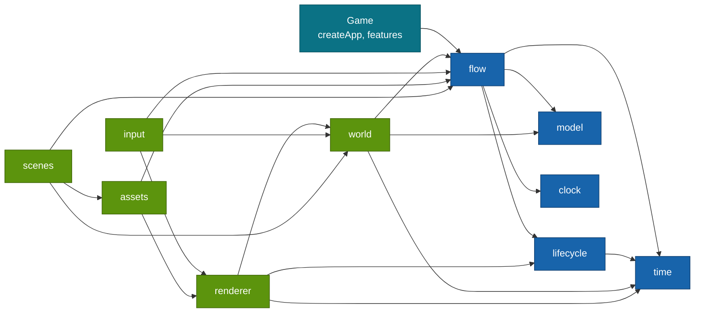

# @moku-labs/game

**A 2D puzzle game engine where the game is a deterministic graph of business logic.**

`@moku-labs/game` is a Layer-2 framework on [`@moku-labs/core`](https://github.com/moku-labs/core), written in TypeScript, with PixiJS v8 as a peer dependency. You write small nodes and edge tables. The engine runs them, commits state on the edges, saves at rest points and replays the same game without a screen. It is not a general-purpose engine and it ships no genre rules: no match-3, no merge, no physics. V1 is the logic half; V2 adds the screen: an own small ECS, projections from committed state, a Pixi v8 renderer loaded lazily, gestures as data components, typed asset keys and scenes as declarations.

<br/>

[](#status)
[](#requirements)
[](#requirements)
[](#requirements)
[](https://github.com/moku-labs/core)
[](./LICENSE)

<br/>

[Why](#why-moku-labsgame) · [Status](#status) · [Install](#install) · [Quick start](#quick-start) · [How it works](#how-it-works) · [Plugins](#plugins) · [Events](#events) · [Configuration](#configuration) · [Development](#development) · [Requirements](#requirements) · [Docs](#docs)

---

## Why @moku-labs/game

- **The game is a graph.** Flows are edge tables, nodes are small functions with plain `await` bodies. Exactly one node is active at any time.
- **State commits only on edges.** A node works on drafts. The runner commits them when the node returns an outcome. A node that throws changes nothing.
- **Position is data.** Node path, input and state describe the whole game. That gives checkpoints, rollback, bookmarks, fast walk and repro runs.
- **Input and world events are answers.** A rest node waits. A player answer comes through the gate, a world event comes through the inbox. Nothing else moves the graph.
- **The screen is a projection, not the game.** Rendering reads committed state and never owns it. A projection is one pure `view(item)` function; the engine diffs the components and plays enter, exit, change and settle motions. The same game plays whole headless.
- **Deterministic by construction.** Time is an input named `now`. Randomness is a persisted `rng` stream. Lint rule L3 refuses `Date.now` and `Math.random` in the logic set.

## Status

V1 and V2 are built. Everything below V2 is a plan and may change.

| Milestone | State | Scope | Exit criterion |
|---|---|---|---|
| V1 | built | `time`, `lifecycle`, `model`, `clock`, `flow`, the `@moku-labs/game/testing` entry | A fixture game is played to the end headless |
| V2 | built | `world`, `renderer`, `input`, `assets`, `scenes`, the `@moku-labs/game/assets-scan` entry | A board is visible and items merge by drag; the same game still plays to the end headless |
| V3 | planned | `anim`, `i18n`, `audio`, `text`, `ui` | Popup, HUD and buttons with sound |
| V4 | planned | `/inspect` and `/control` entries | External tools can read and drive a game |
| V5 | planned | `effects`, production mode of `assets`, visual test helpers | Not defined yet |
| V6 | planned | `platform` | A template game runs on a phone |

Rendering: WebGPU is preferred, with Pixi's WebGL fallback and an honest "unsupported device" screen when neither exists.

## Install

```sh
bun add @moku-labs/game pixi.js
```

> [!NOTE]
> **Status: `0.0.0`, not published yet.** The package is not on npm. The command above is the intended install line. `pixi.js` `^8.0.0` is a peer dependency. No V1 code imports it.

> [!IMPORTANT]
> Bun only. ESM only. `"sideEffects": false`. There is no CJS build.

## Quick start

A tiny dice game: one rest node, two transit nodes, one flow.

**1. Bind the helpers to the types of the game.** `defineNode` and `defineFlow` come from `defineGame`. They are not root exports.

```ts
// state.ts
import { defineGame } from "@moku-labs/game";

export type Player = { coins: number; lastRoll: number };
export type Session = { rolls: number };

export const { defineNode, defineFlow, defineFeature } = defineGame<{
  player: Player;
  session: Session;
  assets: string;
  strings: Record<string, unknown>;
}>();
```

**2. Write the nodes.** A rest node without a body is a pure wait. The intent of the answer names the outcome.

```ts
// nodes.ts
import { type } from "@moku-labs/game";
import { defineNode } from "./state";

export const home = defineNode({
  outcomes: { roll: type(), reset: type() },
  rest: true,
  checkpoint: true
});

export const roll = defineNode({
  outcomes: { done: type() },
  run: ({ player, session, rng, out }) => {
    const face = rng.stream("dice").range(1, 6);

    player.coins += face;
    player.lastRoll = face;
    session.rolls += 1;
    return out.done();
  }
});

export const reset = defineNode({
  outcomes: { done: type() },
  run: ({ player, out }) => {
    player.coins = 0;
    return out.done();
  }
});
```

**3. Wire the flow.** The edge table is checked by the compiler. A missing edge or an unknown target is a compile error with a sentence.

```ts
// flow.ts
import { defineFlow } from "./state";
import { home, reset, roll } from "./nodes";

export const mainFlow = defineFlow("main", {
  nodes: { home, roll, reset },
  start: "home",
  edges: {
    home: { roll: "roll", reset: "reset" },
    roll: { done: "home" },
    reset: { done: "home" }
  }
});
```

**4. Create the app.** The graph is started by the game, never by the plugin.

```ts
// game.ts
import { createApp } from "@moku-labs/game";
import { mainFlow } from "./flow";

export const createGame = (seed: "from-save" | number = "from-save") =>
  createApp({
    pluginConfigs: {
      model: { initialPlayer: { coins: 0, lastRoll: 0 }, initialSession: { rolls: 0 }, seed },
      flow: { mainFlow, safeNode: "home" }
    },
    onStart: ctx => {
      ctx.flow.run().catch((error: unknown) => {
        ctx.log.error("game: the graph failed", { error });
      });
    }
  });
```

A hook that throws never stops the game. The engine writes it to the log as the error entry `"game: a hook failed"`; read it with `app.log.trace()`. A game can add its own `onError: (error, ctx) => …` to `createApp`; the kernel calls both.

**5. Play it headless.** `createHeadless` returns a game object once the graph rests at its first
rest node. Its `walk` method plays a route.

```ts
// game.test.ts
import type { Flow } from "@moku-labs/game";
import { createHeadless } from "@moku-labs/game/testing";
import { expect, it } from "vitest";
import { createGame } from "./game";

const rollOnce: Flow.RouteStep = { at: "home", intent: "roll" };

it("plays two rolls and a reset without a screen", async () => {
  const app = createGame(42);
  const game = await createHeadless(app);

  const state = await game.walk([rollOnce, rollOnce]);

  expect(state.path).toBe("home");
  expect(app.model.store.snapshot().session).toEqual({ rolls: 2 });

  await game.walk([{ at: "home", intent: "reset" }]);

  expect(app.model.store.snapshot().player).toMatchObject({ coins: 0 });

  await game.stop();
});
```

In a live game the same answer comes from the screen: `app.flow.gate.answer({ intent: "roll" })`.

> [!TIP]
> Types reach a game through one namespace per plugin: `import type { Flow, Model, Clock, Lifecycle, Time } from "@moku-labs/game"`, then `Flow.RouteStep`, `Model.PlayerStateProvider`, `Time.Phase`.

> [!TIP]
> A larger worked example lives in [`tests/integration/merge-game/`](./tests/integration/merge-game). It is a small game written on the public API only, with sub-flows, a slot, a feature and timers. It is an internal test fixture and is not published. Its scenario is [`tests/integration/template-merge.test.ts`](./tests/integration/template-merge.test.ts).

## How it works


### The contract

| Term | Meaning |
|---|---|
| Node | `defineNode({ input?, outcomes, run })`. The body gets one context object and returns `out.name(data)`. |
| Node context | `{ input, player, session, rng, fx, out, signal, now }`. `player` and `session` are drafts. `now` is `clock.now()` read once at node entry. |
| Rest node | `rest: true`. The graph waits here. Without `run` it is a pure wait for a gate answer or an inbox event. Entering it marks a rest point. |
| `checkpoint` | A rest node where the journal is compacted. `safeNode` points at one. |
| `barrier` | After the edge of this node the save is written durably with `commitDurable`. Rollback cannot cross it. Every edge of a barrier node leads to a rest node of the same flow. |
| `over` | The node waits while a pointer is down, so a popup never appears in the middle of a drag. |
| `inbox` | Outcome names of a rest node that a world event of the same type may produce. |
| Flow | `defineFlow(id, { nodes, start, edges, input?, outcomes? })`. A flow with `outcomes` is used as a node of another flow. |
| Edge target | A node name, `exit("outcome")` to leave a sub-flow, or `to("node", payload => input)` to adapt the payload. |
| Slot | `slot("name")`. An extension point. Features contribute sub-flows to it with an `order`. |
| Feature | `defineFeature(name, { nodes?, flows?, contribute? })`. An ordinary plugin that registers into `flow.features`. `feature.logicOnly` is the headless twin. |
| Effect | `await fx(descriptor)` for awaited effects, `fx.emit(hint(kind, payload))` for cosmetic ones. Hints are released after the commit and dropped in fast mode. |
| Transition | Rest node to rest node. It is a transaction. An error rolls back to the last rest point, retries, then enters `safeNode`. |

## Plugins

Seven plugins are on every app; the five screen plugins are the list `screen` a game spreads in. `log` and `env` come from [`@moku-labs/common`](https://github.com/moku-labs/common) and sit on every plugin context as `ctx.log` and `ctx.env`.

### Built

| Plugin | Tier | Owns | Key API |
|---|---|---|---|
| [`time`](./src/plugins/time/README.md) | Standard | The single `requestAnimationFrame` loop, six frame phases, the `Time` resource | `onFrame(phase, callback)`, `snapshot()`, `setScale(scale)`, `pause()`, `resume()`, `isPaused()`, `isRunning()`, `step(deltaMs)` |
| [`lifecycle`](./src/plugins/lifecycle/README.md) | Standard | The stack of pause reasons. Pauses `time` by a direct call | `push(reason)`, `pop(reason)`, `reasons()`, `isPaused()` |
| [`model`](./src/plugins/model/README.md) | Very Complex | The `session` tree and the save document `{ player, rng }`, transactions, rest-point rollback, rng streams | `store.load()`, `store.snapshot()`, `store.begin()`, `store.markRest()`, `store.markBarrier(txId)`, `store.rollback()`, `store.restore(input)`, `store.flush()`, `rng.peek(id)` |
| [`clock`](./src/plugins/clock/README.md) | Standard | Trusted time as an input: monotonic `now()` and one `elapsed` signal at the next due moment | `now()`, `scheduleAt(moment)`, `onElapsed(listener)`, `poke()`, `dueAt()` |
| [`flow`](./src/plugins/flow/README.md) | Very Complex | The graph: runner, gate, inbox, effects gateway, features registry | `run()`, `onEnter(stage, callback)`, `walk(route, options?)`, `bookmark()`, `restore(bookmark)`, `describe()`, `state()`, `history()`, `setMode(mode)`, `gate.answer(answer)`, `gate.pointer(active)`, `gate.state()`, `inbox.post(event)`, `fx.handle(kind, handler, options?)`, `fx.dispatch(descriptor)`, `features.register(name, description)`, `features.all()`, `features.contributions(slotName)` |
| [`world`](./src/plugins/world/README.md) | Very Complex | A zero-dependency ECS (`ecs`) and the projection from committed state to entities (`projection`): keyed reconcile of one `view(item)` function, retarget motions, a despawn queue, named layers | `ecs.spawn(owner, components)`, `ecs.query(...Components)`, `ecs.system(def)`, `ecs.set(entity, Component, patch)`, `ecs.changed(Component)`, `ecs.snapshot()`, `ecs.mode()`, `projection.mount(names, owner)`, `projection.setLayers(list)`, `projection.settle(entity)`, `projection.keyOf(entity)`, `projection.entityOf(projection, key)` |
| [`renderer`](./src/plugins/renderer/README.md) | Very Complex | The Pixi v8 host loaded lazily (`host`), one `sync` system that owns every display object, the reference viewport of short side 1080 (`viewport`) | `host.ready()`, `host.kind()`, `host.canvas()`, `sync.hitTest(x, y, accept)`, `sync.textures.provide(fn)`, `sync.displayOf(entity)`, `viewport.toReference(x, y)`, `viewport.size()` |
| [`input`](./src/plugins/input/README.md) | Standard | Gestures as data components: `Tappable`, `Pressable`, `Draggable`, `DropTarget`, `Swipeable`; the drop target names the intent that reaches `flow.gate` | `tap(target)`, `press(target)`, `drag(from, to)`, `swipe(target, direction)` |
| [`assets`](./src/plugins/assets/README.md) | Complex | The manifest, five load tiers, graph-driven preload, a texture budget with LRU unload; typed keys from the `assets-scan` entry | `load(bundle)`, `unload(bundle)`, `isLoaded(bundle)`, `texture(key)`, `usage()` |
| [`scenes`](./src/plugins/scenes/README.md) | Standard | A scene as a declaration: bundle, layers, projections. A node names its scene; the runner switches through `flow.onEnter` | `current()` |



An arrow means "depends on". `time`, `model` and `clock` depend on nothing. The logic plugins are registered in this order: `time`, `lifecycle`, `model`, `clock`, `flow`; the screen set `screen` follows as `world`, `renderer`, `input`, `assets`, `scenes`. Without a document the screen plugins are inert: the same app starts in plain Bun.

### Planned

Not built. Names are reserved: `defineFeature` refuses them as feature names. Scope and tiers come from the plan and may change.

| Plugin | Milestone | Tier | Depends on | Will own |
|---|---|---|---|---|
| `anim` | V3 | Complex | `flow`, `world` | Tweens and motion |
| `i18n` | V3 | Standard | `flow`, `world`, `assets` | String tables per locale |
| `text` | V3 | Complex | `world`, `renderer`, `assets`, `i18n` | Text rendering and the text field |
| `ui` | V3 | Very Complex | `flow`, `world`, `renderer`, `anim`, `i18n`, `text` | JSX components, styles, layout |
| `audio` | V3 | Standard | `lifecycle`, `flow`, `assets`, `scenes` | Audio context and unlock |
| `effects` | V5 | Complex | `flow`, `world`, `renderer` | Particles, filters, frames |
| `platform` | V6 | Standard | `lifecycle`, `flow` | The native provider: background, system dialogs |

### Root exports

| Export | Kind | Purpose |
|---|---|---|
| `createApp` | function | Creates a game application |
| `createPlugin` | function | Creates a game plugin bound to the engine's config and events |
| `defineGame` | function | Returns `{ defineNode, defineFlow, defineFeature }` typed with the game's `player` and `session` |
| `defineFeature` | function | Turns a feature description into a plugin |
| `type`, `exit`, `to`, `slot` | functions | Type tag of a payload, and the three graph helpers for edge targets and slots |
| `schedule`, `guide`, `hint` | functions | Effect descriptors: next due moment, tutorial narrowing of the gate, cosmetic hint |
| `SaveUnreadableError` | class | Thrown by `model.store.load()` when the save cannot be read |
| `timePlugin`, `lifecyclePlugin`, `modelPlugin`, `clockPlugin`, `flowPlugin` | plugin instances | For `depends` and `ctx.require` in game plugins |
| `Time`, `Lifecycle`, `Model`, `Clock`, `Flow` | type namespaces | All public types of one plugin |

### Testing entry

`@moku-labs/game/testing` re-exports the headless helpers.

| Export | Signature | Purpose |
|---|---|---|
| `createHeadless` | `(app: HeadlessApp) => Promise<HeadlessGame>` | Sets flow mode `"fast"`, starts the app, starts `flow.run()` unless the app already did, and waits for the first rest point |
| `runRepro` | `(app: HeadlessApp, repro: Repro) => Promise<ReproResult>` | Restores a state and a checkpoint, then walks a route |
| `stepFrames` | `(app: HeadlessApp, count: number, deltaMs: number) => void` | Calls `app.time.step(deltaMs)` `count` times |
| `fakeClock` | `(start = 0) => FakeClock` | A `ClockSource` with `advance(ms)` and `set(moment)` |
| `memory` | `(fixture?: { state: SaveDoc; version: number }) => PlayerStateProvider & { calls: ProviderCall[] }` | In-memory save provider. It keeps what it was committed and records every call |
| `saveOf` | `(player: Json, seed?: number) => SaveDoc` | Builds a save document for a fixture |

A `HeadlessGame` has `walk(route)`, `answer(answer)`, `state()`, `history()` and `stop()`.

## Events

Global events are empty: every event belongs to a plugin. `time` and `clock` emit nothing.

| Event | Emitted by | Payload | When |
|---|---|---|---|
| `lifecycle:changed` | `lifecycle` | `{ reason: PauseReason; action: "push" \| "pop"; reasons: readonly PauseReason[]; paused: boolean; resumed: boolean }` | The pause stack really changed. `resumed` is true only on the change that emptied the stack |
| `model:committed` | `model` | `{ roots: readonly Root[]; cause: "edge" \| "rollback" \| "restore" \| "load" }` | Committed state changed. `Root` is `"player" \| "session" \| "rng"` |
| `flow:edge` | `flow` | `{ flow: string; node: string; outcome: string; payload: Json; next: string; patches: { doc: Patch[]; session: Patch[] }; index: number; now: number }` | After the commit of an edge |
| `flow:rest` | `flow` | `{ path: string; checkpoint: boolean }` | The graph entered a rest node |
| `flow:error` | `flow` | `{ path: string; error: unknown; rolledBackTo: string; retry: boolean }` | A node failed and the graph rolled back |
| `world:reconciled` | `world` | counts per reconcile | Dev only, behind `reconciledEvent` |
| `renderer:device-lost` | `renderer` | `{ kind, reason }` | The GPU device or context was lost; `lifecycle` is pushed |
| `assets:bundle-loaded`, `assets:bundle-unloaded` | `assets` | `{ bundle, tier, mb, reason }` | A bundle entered or left memory |
| `scenes:changed` | `scenes` | `{ from, to, music }` | The scene switched on entering a node |

```ts
import { createPlugin, flowPlugin } from "@moku-labs/game";

export const edgeLog = createPlugin("edgeLog", {
  depends: [flowPlugin],
  hooks: ctx => ({
    "flow:edge": payload => {
      ctx.log.info("edge", { node: payload.node, outcome: payload.outcome });
    }
  })
});
```

## Configuration

### Global

```ts
createApp({ config: { orientation: "landscape", referenceSide: 1080 } });
```

| Key | Type | Default | Meaning |
|---|---|---|---|
| `orientation` | `"portrait" \| "landscape"` | `"portrait"` | Screen orientation the game is designed for |
| `referenceSide` | `number` | `1080` | Short side of the reference resolution in pixels |

### Per plugin

Set with `createApp({ pluginConfigs: { <plugin>: { ... } } })`.

| Plugin | Key | Type | Default | Meaning |
|---|---|---|---|---|
| `time` | `maxFps` | `30 \| 60 \| 120` | `60` | Frame rate cap |
| `time` | `maxDeltaMs` | `number` | `50` | Upper bound of one frame's delta in milliseconds |
| `lifecycle` | none | | | The plugin has no config |
| `model` | `playerProvider` | `PlayerStateProvider \| undefined` | `undefined` | The save seam. `undefined` means an in-memory provider: the save lives as long as the app does |
| `model` | `initialPlayer` | `Json` | `{}` | Player state of a new player. Deep-cloned |
| `model` | `initialSession` | `Json` | `{}` | Session state at every start. Deep-cloned |
| `model` | `seed` | `"from-save" \| number` | `"from-save"` | `"from-save"`: a new player gets a random seed once. A number fixes it for tests |
| `model` | `schemaVersion` | `number` | `1` | Version of the save schema this build writes |
| `model` | `migrations` | `readonly Migration[]` | `[]` | Ordered chain. `up` of `from: n` produces version `n + 1` |
| `clock` | `source` | `ClockSource \| undefined` | `undefined` | Time source. `undefined` means the system source. Tests pass `fakeClock()` |
| `flow` | `mainFlow` | `AnyFlow \| undefined` | `undefined` | The top-level flow. Required before `run()` |
| `flow` | `safeNode` | `string \| undefined` | `undefined` | Path of the checkpoint entered after a failed retry. `undefined` means the main flow's `start` |
| `flow` | `retries` | `number` | `1` | Retries of a failed transition before `safeNode` |
| `flow` | `settleTimeoutMs` | `number` | `2000` | How long `onStop` waits for the active node to settle after abort |
| `flow` | `journalLimit` | `number` | `500` | Journal entries kept between checkpoints |
| `world` | `settleMs` | `number` | `350` | Length of the default settle motion |
| `world` | `reconciledEvent` | `boolean` | `false` | Emit `world:reconciled` after every reconcile (dev tools) |
| `renderer` | `mount` | `string \| undefined` | `undefined` | Selector of the mount element. `undefined` keeps the renderer inert |
| `renderer` | `preference` | `"webgpu" \| "webgl"` | `"webgpu"` | Preferred backend; Pixi falls back to WebGL |
| `renderer` | `background`, `antialias`, `maxResolution`, `aspect`, `poolLimit`, `unsupportedMessage`, `loadPixi` | | see the plugin README | Host, viewport and pool settings; `loadPixi` is the lazy loader, a test passes a fake |
| `input` | `tapSlopPx`, `longPressMs`, `dragStartPx`, `swipeMinPx`, `swipeMaxMs` | `number` | `12`, `450`, `8`, `48`, `300` | Gesture thresholds in reference px and ms |
| `assets` | `manifest` | `string \| Manifest \| undefined` | `undefined` | Manifest URL, or the parsed file in a test |
| `assets` | `textureBudgetMb` | `number` | `192` | Texture memory budget for the LRU unload |
| `assets` | `preloadDepth` | `number` | `2` | Graph edges walked for the preload at a rest node |
| `assets` | `baseUrl`, `io` | | `undefined` | The CDN seam and the fetch/decode/texture seam a test replaces |

## Development

### Scripts

```sh
bun run build              # build with tsdown: dist/index.mjs and dist/testing.mjs
bun run typecheck          # tsc --noEmit
bun run lint               # biome check . && eslint .
bun run lint:fix           # biome check --write . && eslint --fix .
bun run format             # biome format --write .
bun run test               # all tests, vitest run
bun run test:unit          # vitest project "unit"
bun run test:integration   # vitest project "integration"
bun run test:coverage      # both projects with coverage, 90% thresholds
bun run validate           # publint and attw with the esm-only profile
bun run release:setup      # moku-release setup
bun run release:doctor     # moku-release doctor
bun run release            # moku-release
```

### Test layout

| Path | Holds |
|---|---|
| `tests/unit/` | Framework-level unit tests: root index, setup |
| `tests/integration/` | Framework-level scenarios across plugins |
| `tests/integration/merge-game/` | The fixture game, written on the public API only. Not published |
| `src/plugins/<name>/__tests__/unit/` | Unit tests of one plugin |
| `src/plugins/<name>/__tests__/integration/` | Integration tests of one plugin |
| `src/plugins/flow/__tests__/types/` | Type-level tests of the graph typing |

Plugin tests never go into the root `tests/` folder. Coverage thresholds are 90% for lines, functions, branches and statements.

### Lint rules L1 to L6

The project rules live in [`eslint.config.ts`](./eslint.config.ts).

| Rule | Says | Applies to |
|---|---|---|
| L1 | A module imports a sibling module only as `import type` from its `types.ts`. The plugin `index.ts` injects sibling APIs | Modules of `model` and `flow` |
| L2 | No static import of `pixi.js` or `yoga-layout`. They are loaded lazily with `import()` | `src/**` |
| L3 | Determinism: no `Date.now`, `performance.now`, `new Date`, `Math.random`, `setTimeout`, `setInterval` | `model`, `flow`, `clock` except `clock/system.ts`, and the rules of the fixture game |
| L4 | The rules of the fixture game import only their siblings | `tests/integration/merge-game/rules/` |
| L5 | No module-scope state: no top-level `let`, no top-level `Map`, `Set`, `WeakMap`, `WeakSet`. No allowlist | `src/**` |
| L6 | Plugin wiring files need no JSDoc on small inline arrows. Every function declaration and every exported type needs JSDoc with description, params and returns | `src/plugins/*/index.ts` |
| L7 | The public contract carries the docs: every member of a `…Api` type in `types.ts` has JSDoc and a scenario `@example` (when it is called, literal arguments, the result). A member another plugin calls is shown from that plugin's point of view; there is no private tier and no exemption. The implementation of an API method has no JSDoc. Elsewhere an example is allowed, never required | `src/plugins/**/types.ts` |
| L8 | No signature echo: an `@example` whose whole body is one call with bare identifiers is an error | `src/**` |

## Requirements

- **Node `>= 24`** and **Bun `>= 1.3.14`**. Use `bun` only, never npm, yarn or pnpm.
- **TypeScript** in strict mode, with `exactOptionalPropertyTypes` and `noUncheckedIndexedAccess`.
- **`pixi.js` `^8.0.0`** as a peer dependency.
- **[`@moku-labs/core`](https://github.com/moku-labs/core)** is the kernel: plugins, lifecycle, events. **[`@moku-labs/common`](https://github.com/moku-labs/common)** brings `log` and `env`.

## Docs

- [`time`](./src/plugins/time/README.md): frame loop, phases, `step`
- [`lifecycle`](./src/plugins/lifecycle/README.md): pause reasons
- [`model`](./src/plugins/model/README.md): store, rng, provider seam, migrations
- [`clock`](./src/plugins/clock/README.md): `now`, `scheduleAt`, `fakeClock`
- [`flow`](./src/plugins/flow/README.md): runner, gate, inbox, fx, features
- [`llms.txt`](./llms.txt): overview for an LLM that writes a game on this engine
- [Moku Core specification](https://github.com/moku-labs/core/tree/main/specification)

## License

[MIT](./LICENSE) © [moku-labs](https://github.com/moku-labs)
