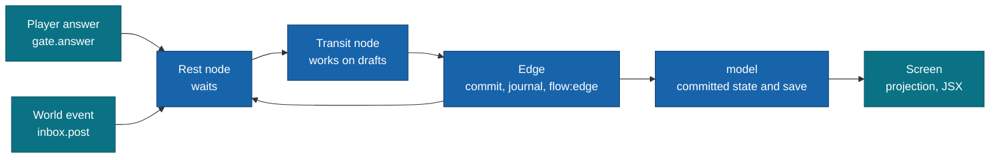

# @moku-labs/game

**A 2D puzzle engine where the game is a graph, and the screen is just an opinion about it.**

You write small nodes and edge tables. The engine runs them, saves on the edges and replays the whole game without a screen. It ships no genre rules.

<br/>

[](https://www.npmjs.com/package/@moku-labs/game)
[](#requirements)
[](#requirements)
[](#requirements)
[](https://github.com/moku-labs/core)
[](./LICENSE)

<br/>

[Why](#why) · [Status](#status) · [Install](#install) · [Quick start](#quick-start) · [How it works](#how-it-works) · [Plugins](#plugins) · [Docs](#docs)

---

## Why

- **The game is a graph.** Flows are edge tables. Nodes are small functions with plain `await` bodies. One node is active at a time.
- **State commits only on edges.** A node works on drafts. The runner commits them when the node returns an outcome. A node that throws changes nothing.
- **Position is data.** Node path, input and state describe the whole game. Checkpoints, rollback, bookmarks and repro runs come for free.
- **The screen is a projection.** Rendering reads committed state and never owns it. The same game plays whole in plain Bun, with no screen at all.
- **Deterministic by construction.** Time is an input named `now`. Randomness is a saved `rng` stream. A lint rule refuses `Date.now` and `Math.random` in game logic.
- **Data, not classes.** Animations, strings, styles, scenes and effects are frozen data. An AI agent can write them. So can you, on a bad day.

## Status

> [!NOTE]
> **`0.4`: working, still young.** It runs on our machines, two emulators and one very patient fixture game. The API may still change before `1.0`.

| Milestone | What it added |
|---|---|
| V1 | The logic: `time`, `lifecycle`, `model`, `clock`, `flow`. A game plays to the end headless. |
| V2 | The screen: an own small ECS, a lazy Pixi v8 renderer, gestures, typed assets, scenes. |
| V3 | The interface: animations, strings, MSDF text, screens in JSX, sound. |
| V4 | Two doors for the editor: read a running game, drive a dev build. The editor itself lives elsewhere. |
| V5 | Particles, WGSL filters, sprite frames, the production asset pack, a text field, visual tests. |
| V6 | `platform`: Back button, haptics, keep-awake. Filters on WebGL. The game as a Tauri app on iOS and Android. |

Strings are ICU messages with durations, translator notes, a pseudo-locale, and export and import for translators.

Rendering is WebGPU first, with Pixi's WebGL fallback. A device with neither gets an honest "unsupported device" screen.

## Install

```sh
bun add @moku-labs/game pixi.js
```

> [!IMPORTANT]
> Bun only. ESM only. There is no CJS build. `pixi.js` `^8.0.0` is a peer dependency. Screens are `.tsx`, so a game sets `"jsx": "react-jsx"` and `"jsxImportSource": "@moku-labs/game"`.

## Quick start

A dice game in three files: one rest node, one working node, one flow.

```ts
// state.ts: bind the helpers to the types of the game
import { defineGame } from "@moku-labs/game";

export const { defineNode, defineFlow } = defineGame<{
  player: { coins: number };
  session: { rolls: number };
  assets: string;
  strings: Record<string, unknown>;
}>();
```

```ts
// flow.ts: nodes and the edge table, checked by the compiler
import { type } from "@moku-labs/game";
import { defineFlow, defineNode } from "./state";

const home = defineNode({ outcomes: { roll: type() }, rest: true, checkpoint: true });

const roll = defineNode({
  outcomes: { done: type() },
  run: ({ player, session, rng, out }) => {
    player.coins += rng.stream("dice").range(1, 6);
    session.rolls += 1;
    return out.done();
  }
});

export const mainFlow = defineFlow("main", {
  nodes: { home, roll },
  start: "home",
  edges: { home: { roll: "roll" }, roll: { done: "home" } }
});
```

```ts
// game.test.ts: play it with no screen
import { createApp } from "@moku-labs/game";
import { createHeadless } from "@moku-labs/game/testing";
import { mainFlow } from "./flow";

const app = createApp({
  pluginConfigs: {
    model: { initialPlayer: { coins: 0 }, initialSession: { rolls: 0 }, seed: 42 },
    flow: { mainFlow, safeNode: "home" }
  },
  onStart: ctx => {
    ctx.flow.run().catch((error: unknown) => ctx.log.error("game: the graph failed", { error }));
  }
});

const game = await createHeadless(app);
await game.walk([{ at: "home", intent: "roll" }, { at: "home", intent: "roll" }]);
app.model.store.snapshot().session; // { rolls: 2 }
```

The full version, with a reset node and a vitest file, is in [docs/quick-start.md](./docs/quick-start.md). A bigger game lives in [`tests/integration/merge-game/`](./tests/integration/merge-game). It is a test fixture and is not published.

A game with a screen gets two more things from the package. The body font `fonts/font-body.*` (Pangolin, SIL OFL 1.1) is the default of the built-in text style `body` once copied into `src/features/ui/assets/`. The bin `moku-game-assets` writes the typed asset keys, the manifest and the strings. It runs under bun; with node only, run `bun node_modules/@moku-labs/game/dist/assets.mjs`. Both are in [docs/quick-start.md](./docs/quick-start.md#a-screen-the-body-font-and-the-asset-keys).

## How it works


```mermaid
flowchart LR
  P["Player answer<br/>gate.answer"] --> R["Rest node<br/>waits"]
  W["World event<br/>inbox.post"] --> R
  R --> N["Transit node<br/>works on drafts"]
  N --> E["Edge<br/>commit, journal, flow:edge"]
  E --> R
  E --> M["model<br/>committed state and save"]
  M --> S["Screen<br/>projection, JSX"]
  classDef u fill:#0b7285,stroke:#08525f,color:#fff;
  classDef m fill:#1864ab,stroke:#0d3d6e,color:#fff;
  class P,W,S u
  class R,N,E,M m
```

A rest node waits. A player answer comes through the gate. A world event comes through the inbox. Nothing else moves the graph.

| Term | Meaning |
|---|---|
| Node | `defineNode({ input?, outcomes, run })`. Returns `out.name(data)`. |
| Rest node | `rest: true`. The graph waits here. Entering it marks a rest point. |
| `checkpoint` | A rest node where the journal is compacted. `safeNode` points at one. |
| `barrier` | The save is written durably after this node. Rollback cannot cross it. |
| Flow | `defineFlow(id, { nodes, start, edges })`. A flow with `outcomes` is a node of another flow. |
| Edge target | A node name, `exit("outcome")` to leave a sub-flow, or `to("node", mapper)`. |
| Slot | `slot("name")`. Features contribute sub-flows to it. |
| Feature | `defineFeature(name, { nodes?, flows?, contribute? })`. A plugin that adds to the graph. |
| Effect | `await fx(descriptor)` for awaited effects, `fx.emit(hint(...))` for cosmetic ones. |
| Transition | Rest node to rest node, as one transaction. An error rolls back and retries. |

The full contract, with the node context, `over` and `inbox`, is in [docs/quick-start.md](./docs/quick-start.md#the-contract).

## Plugins

Five logic plugins run in every app. The nine screen plugins come as one list, `screen`. Three more are opt-in.

```ts
createApp({ plugins: [...screen, effectsPlugin, audioPlugin, platformPlugin] });
```

| Plugin | Set | What it does |
|---|---|---|
| [`time`](./src/plugins/time/README.md) | logic | One frame loop, six phases, `step` for tests |
| [`lifecycle`](./src/plugins/lifecycle/README.md) | logic | A stack of pause reasons |
| [`model`](./src/plugins/model/README.md) | logic | Player and session state, the save, `rng` streams, migrations |
| [`clock`](./src/plugins/clock/README.md) | logic | Trusted `now()` and timers stored as moments |
| [`flow`](./src/plugins/flow/README.md) | logic | The graph: runner, gate, inbox, effects, features |
| [`world`](./src/plugins/world/README.md) | screen | A small ECS and projections from committed state |
| [`renderer`](./src/plugins/renderer/README.md) | screen | Pixi v8, loaded lazily, synced from the ECS |
| [`input`](./src/plugins/input/README.md) | screen | Gestures as data: tap, press, drag, swipe |
| [`assets`](./src/plugins/assets/README.md) | screen | Manifest, load tiers, typed keys, the production pack |
| [`scenes`](./src/plugins/scenes/README.md) | screen | A scene as a declaration: bundle, layers, music |
| [`anim`](./src/plugins/anim/README.md) | screen | Choreography as data: tweens, timelines, motions |
| [`i18n`](./src/plugins/i18n/README.md) | screen | Strings as data, ICU messages, compiled per locale |
| [`text`](./src/plugins/text/README.md) | screen | MSDF text, styles, inline tags and icons |
| [`ui`](./src/plugins/ui/README.md) | screen | Screens in JSX, Yoga layout, popups, styles |
| [`effects`](./src/plugins/effects/README.md) | opt-in | Particles and filters as components, WGSL and GLSL |
| [`audio`](./src/plugins/audio/README.md) | opt-in | Music and sound effects on three buses |
| [`platform`](./src/plugins/platform/README.md) | opt-in | The phone: Back button, haptics, keep-awake |

`log` and `env` come from [`@moku-labs/common`](https://github.com/moku-labs/common). The dependency graph and every root export are in [docs/plugins.md](./docs/plugins.md).

### Entry points

| Import | Runs in | For |
|---|---|---|
| `@moku-labs/game` | anywhere | The engine: plugins, helpers, components |
| `@moku-labs/game/testing` | anywhere | Headless games, the fake clock, the in-memory save |
| `@moku-labs/game/visual` | Node and Bun | Visual tests: baselines of state, describe and pixels |
| `@moku-labs/game/assets` | Node and Bun | Asset keys, the manifest, strings, the pack |
| `@moku-labs/game/inspect` | anywhere | Read a running game |
| `@moku-labs/game/control` | dev builds | Drive a running game |
| `@moku-labs/game/hot` | the Bun dev server | The `bunfig.toml` plugin that hot swaps views. See [Hot swap](./docs/hot-swap.md) |
| `@moku-labs/game/lint` | oxlint | The game lint rules, as an oxlint JS plugin |
| `@moku-labs/game/project` | Node and Bun | Where every engine id of a game is defined, line fresh at the call. The bin `moku-game-index`. See [Project index](./docs/project-index.md) |
| `@moku-labs/game/jsx-runtime`, `/jsx-dev-runtime` | anywhere | The JSX runtime. A game never imports it by hand. |

### Lint for games

`@moku-labs/game/lint` is an oxlint JS plugin, `moku-game`. It checks the engine rules in a game: lazy Pixi and Yoga, no native package in the logic, the editor only in dev files, no module-scope state, determinism, pure rules and JSX keys the project index can follow.

```json
// .oxlintrc.json
{
  "jsPlugins": ["@moku-labs/game/lint"],
  "rules": {
    "moku-game/lazy-imports": "error",
    "moku-game/native-imports": "error",
    "moku-game/dev-imports": "error",
    "moku-game/no-module-state": "error",
    "moku-game/determinism": "error",
    "moku-game/rules-siblings": "error",
    "moku-game/static-keys": "error"
  }
}
```

Each rule takes `{ "files": [...], "ignores": [...] }`. The defaults follow the template layout. See [Lint for games](./docs/lint.md).

## Docs

| Page | What is inside |
|---|---|
| [Quick start](./docs/quick-start.md) | The full dice game, step by step |
| [Plugins](./docs/plugins.md) | The dependency graph, the plugin table, every root export |
| [Interface in JSX](./docs/jsx.md) | Tags, components, styles, popups |
| [Doors for the editor](./docs/doors.md) | `/inspect` and `/control`, base sources and commands |
| [Hot swap](./docs/hot-swap.md) | Save a view, see it in the running page, no reload |
| [Events](./docs/events.md) | Every event and its payload |
| [Configuration](./docs/configuration.md) | Every config field and its default |
| [Lint for games](./docs/lint.md) | The `moku-game` oxlint rules, their options and defaults |
| [Project index](./docs/project-index.md) | `openProject`, the key scheme, `find` and `watch`, the `moku-game-index` bin |
| [Testing](./docs/testing.md) | Headless and visual tests, all scripts, test layout, lint rules |
| [`llms.txt`](./llms.txt) | The engine in one page, for an AI that writes a game |

Each plugin has its own README, linked in the table above. The kernel is specified in the [Moku Core specification](https://github.com/moku-labs/core/tree/main/specification).

## Development

```sh
bun run build            # tsdown into dist/
bun run typecheck        # tsc --noEmit
bun run lint             # biome check . && eslint .
bun run test             # vitest, unit and integration
bun run test:coverage    # with the 90% threshold
bun run validate         # publint and attw
bun run fixture:visual   # visual tests of the fixture game
bun run fixture:native   # the fixture as a native app
bun run release          # moku-release
```

Every script is in [docs/testing.md](./docs/testing.md#scripts).

### Hot swap

A save of a view file swaps it in the running page, with the same state. One line in the game's `bunfig.toml`:

```toml
[serve.static]
plugins = ["@moku-labs/game/hot"]
```

A save of a logic file reloads the page. What swaps and what reloads: [docs/hot-swap.md](./docs/hot-swap.md).

## Requirements

- **Node `>= 24`** and **Bun `>= 1.3.14`**. Use `bun` only.
- **TypeScript** in strict mode, with `exactOptionalPropertyTypes` and `noUncheckedIndexedAccess`.
- **`pixi.js` `^8.0.0`** as a peer dependency. `playwright-core` for visual tests, `sharp` for the asset pack and `typescript` for the project index are optional peers. `yoga-layout` is loaded lazily by `ui`. The string compiler uses `@formatjs/icu-messageformat-parser` at build time only.
- **[`@moku-labs/core`](https://github.com/moku-labs/core)** is the kernel. **[`@moku-labs/common`](https://github.com/moku-labs/common)** brings `log` and `env`.

## License

[MIT](./LICENSE) © [moku-labs](https://github.com/moku-labs)
