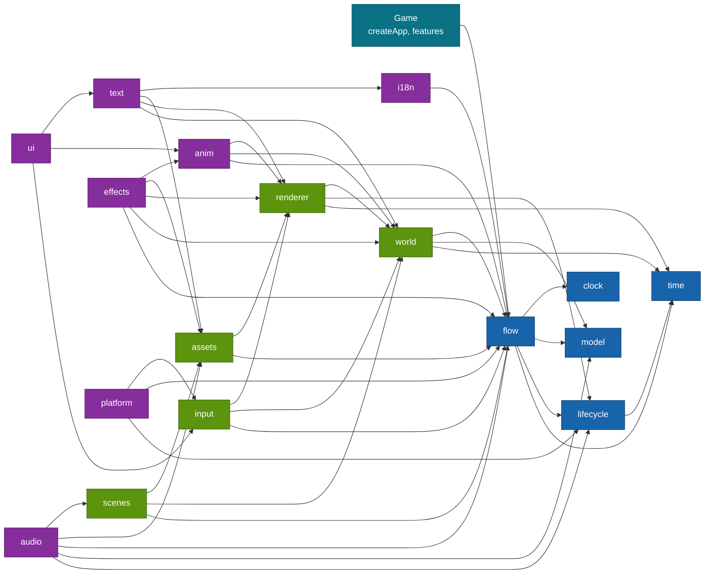

# Plugins

Every plugin, how they depend on each other, and everything the root exports.

Five logic plugins are on every app; the nine screen plugins are the list `screen` a game spreads in; `effects`, `audio` and `platform` are opt-in, `[...screen, effectsPlugin, audioPlugin, platformPlugin]`. `log` and `env` come from [`@moku-labs/common`](https://github.com/moku-labs/common) and sit on every plugin context as `ctx.log` and `ctx.env`.

## Built

| Plugin | Tier | Owns | Key API |
|---|---|---|---|
| [`time`](../src/plugins/time/README.md) | Standard | The single `requestAnimationFrame` loop, six frame phases, the `Time` resource | `onFrame(phase, callback)`, `snapshot()`, `setScale(scale)`, `pause()`, `resume()`, `isPaused()`, `isRunning()`, `step(deltaMs)` |
| [`lifecycle`](../src/plugins/lifecycle/README.md) | Standard | The stack of pause reasons. Pauses `time` by a direct call | `push(reason)`, `pop(reason)`, `reasons()`, `isPaused()` |
| [`model`](../src/plugins/model/README.md) | Very Complex | The `session` tree and the save document `{ player, rng }`, transactions, rest-point rollback, rng streams | `store.load()`, `store.snapshot()`, `store.begin()`, `store.markRest()`, `store.markBarrier(txId)`, `store.rollback()`, `store.restore(input)`, `store.flush()`, `rng.peek(id)` |
| [`clock`](../src/plugins/clock/README.md) | Standard | Trusted time as an input: monotonic `now()` and one `elapsed` signal at the next due moment | `now()`, `scheduleAt(moment)`, `onElapsed(listener)`, `poke()`, `dueAt()` |
| [`flow`](../src/plugins/flow/README.md) | Very Complex | The graph: runner, gate, inbox, effects gateway, features registry | `run()`, `onEnter(stage, callback)`, `walk(route, options?)`, `bookmark()`, `restore(bookmark)`, `describe()`, `state()`, `history()`, `setMode(mode)`, `gate.answer(answer)`, `gate.pointer(active)`, `gate.state()`, `inbox.post(event)`, `fx.handle(kind, handler, options?)`, `fx.dispatch(descriptor)`, `features.register(name, description)`, `features.all()`, `features.contributions(slotName)` |
| [`world`](../src/plugins/world/README.md) | Very Complex | A zero-dependency ECS (`ecs`) and the projection from committed state to entities (`projection`): keyed reconcile of one `view(item)` function, retarget motions, a despawn queue, named layers | `ecs.spawn(owner, components)`, `ecs.query(...Components)`, `ecs.system(def)`, `ecs.set(entity, Component, patch)`, `ecs.changed(Component)`, `ecs.snapshot()`, `ecs.mode()`, `projection.mount(names, owner)`, `projection.setLayers(list)`, `projection.settle(entity)`, `projection.keyOf(entity)`, `projection.entityOf(projection, key)` |
| [`renderer`](../src/plugins/renderer/README.md) | Very Complex | The Pixi v8 host loaded lazily (`host`), one `sync` system that owns every display object, the reference viewport fitted to `referenceSide` and `referenceLong` (`viewport`), the frame numbers: render passes in every build, draw calls in a dev build | `host.ready()`, `host.kind()`, `host.canvas()`, `host.device()`, `sync.hitTest(x, y, accept)`, `sync.textures.provide(fn)`, `sync.filters.set(entity, slots)`, `sync.displayOf(entity)`, `viewport.toReference(x, y)`, `viewport.size()`, `stats()` |
| [`input`](../src/plugins/input/README.md) | Standard | Gestures as data components: `Tappable`, `Pressable`, `Draggable`, `DropTarget`, `Swipeable`; the drop target names the intent that reaches `flow.gate` | `tap(target)`, `press(target)`, `drag(from, to)`, `swipe(target, direction)` |
| [`assets`](../src/plugins/assets/README.md) | Complex | The manifest, five load tiers, graph-driven preload, a texture budget with LRU unload; typed keys from the `assets` entry | `load(bundle)`, `unload(bundle)`, `isLoaded(bundle)`, `texture(key)`, `usage()` |
| [`scenes`](../src/plugins/scenes/README.md) | Standard | A scene as a declaration: bundle, layers, projections, `music`. A node names its scene; the runner switches through `flow.onEnter` | `current()` |
| [`anim`](../src/plugins/anim/README.md) | Complex | The one tween core, installed into `world.projection` as the `TweenDriver`; timelines as frozen data built from typed slots; `defineMotion` sugar for the enter, exit and change hooks; the `Frames` component, a frame loop that walks a sprite's textures for its whole life | `play(animation, slots)`, `finishAll()`, `active()`, `onMark(fn)` |
| [`i18n`](../src/plugins/i18n/README.md) | Complex | Strings as data: `tr(key, params)` is a `Message`, ICU MessageFormat compiled to plain functions by `compileStrings` on the `assets` door, `Part[]` at run time, never a joined string | `locale()`, `setLocale(locale)`, `format(message, locale?)`, `plain(message)`, `has(key)`, `locales()` |
| [`text`](../src/plugins/text/README.md) | Complex | The `Text` component, `label()`, `defineTextStyles()`, the tags `<b> <i> <color=#hex> <icon=key>`, measurement from the font's advance table, BitmapText from the MSDF fonts of a bundle | `measure(content, style)`, `styles()` |
| [`ui`](../src/plugins/ui/README.md) | Very Complex | A screen is a projection whose `view` returns JSX; the tree is reconciled by identity into entities, laid out by one Yoga solve per change, `Box` is the rest pose; `defineComponent` with `local` and `outcomes`, `popup` as an effect, `defineStyle`, `defineTokens`; every tag takes `components`, extra component values such as a filter; the `input` tag is a text field whose text lives in `local` | `tree()`, `find(key)`, `lint()`, `fill(key, value)` |
| [`audio`](../src/plugins/audio/README.md) | Standard | Opt-in. Buses `master`, `music`, `sfx`; `sfx()` descriptors of `anim` and `music()` descriptors handled here; the scene's `music`; volumes read from the committed player through `volumes` | `setVolume(bus, value)`, `volume(bus)`, `mute(bus, on)`, `unlocked()` |
| [`effects`](../src/plugins/effects/README.md) | Complex | Opt-in. Particles: `defineEmitter` and the `Emitter` component, one Pixi `ParticleContainer` per instance stepped by the engine clock. Filters: `defineFilter` turns a WGSL fragment body and its GLSL twin into a flat component that `tween` drives, so a custom filter draws on WebGPU and on WebGL; `Glow`, `Outline`, `Blur`, `ColorMatrix`, `Noise`, `Displacement`, `Alpha` ship built in. Budgets warn once per crossing; a dev build compiles each kind before its first instance, WGSL on WebGPU and GLSL on WebGL. Headless it draws nothing | `stats()` |
| [`platform`](../src/plugins/platform/README.md) | Standard | Opt-in, last in the array. The phone as a provider: the game passes a `PlatformProvider`; its pause and resume become the `"background"` reason of `lifecycle`, its Back press runs the Back chain (Escape, then the intent `back`, then `exit()`), the `haptic` effect reaches `provider.haptic`, and `keepAwake` keeps the screen on while the game runs. Inert without a provider | `back()` |

An arrow means "depends on"; from `renderer` on, most edges to `time` and `clock` and most edges a nearer plugin already implies are left out for space, the plugin READMEs list them in full. `time`, `model` and `clock` depend on nothing. The logic plugins are registered in this order: `time`, `lifecycle`, `model`, `clock`, `flow`; the screen set `screen` follows as `world`, `renderer`, `input`, `assets`, `scenes`, `anim`, `i18n`, `text`, `ui`; a game that wants particles and filters appends `effectsPlugin`, one that wants sound appends `audioPlugin`, and one in a native shell appends `platformPlugin` last. A game without `effectsPlugin` carries none of its systems, filters or WGSL in its bundle. Without a document the screen plugins are inert: the same app starts in plain Bun, Yoga included.

`defineFeature` refuses every engine plugin name as a feature name.

## Root exports

| Export | Kind | Purpose |
|---|---|---|
| `createApp` | function | Creates a game application |
| `createPlugin` | function | Creates a game plugin bound to the engine's config and events |
| `defineGame` | function | Returns the authoring helpers typed with the game's `player`, `session`, `assets`, `bundles`, `strings`, `textStyles` and `emitters`: `defineNode`, `defineFlow`, `defineFeature`, `projection`, `sprite`, `Sprite`, `NineSlice`, `defineBundles`, `load`, `defineScene`, from V3 `tr`, `label`, `defineTextStyles`, `defineComponent`, `defineStyle`, `defineTokens`, `popup`, `defineAnimation`, `frames`, `sfx`, `play`, `music`, and from V5 `Frames`, `defineEmitter`, `Emitter`, `Displacement`: a texture key the game does not have or an effect id it did not declare does not compile |
| `defineFeature` | function | Turns a feature description into a plugin. V3 keys: `projections`, `animations`, `ui`, `strings`, `textStyles`. V5 keys: `emitters`, `filters` |
| `type`, `exit`, `to`, `slot` | functions | Type tag of a payload, and the three graph helpers for edge targets and slots |
| `schedule`, `guide`, `hint` | functions | Effect descriptors: next due moment, tutorial narrowing of the gate, cosmetic hint |
| `SaveUnreadableError` | class | Thrown by `model.store.load()` when the save cannot be read |
| `component`, `tag`, `resource`, `mut`, `system`, `projection`, `Layer`, `Order`, `Exiting`, `Tree` | functions and components | The ECS vocabulary of `world` and the projection helper |
| `Transform`, `Sprite`, `NineSlice`, `Shape`, `Parent`, `Display`, `sprite` | components | The display components of `renderer` |
| `Tappable`, `Pressable`, `Draggable`, `DropTarget`, `Swipeable`, `Touchable`, `Held`, `Hovered`, `PointerOver`, `Pressed`, `Pointer` | components | Gestures as data, from `input`; `PointerOver` marks the view under an idle mouse or pen (the `hover` style state) |
| `defineBundles`, `load`, `defineScene` | functions | Bundle and scene declarations |
| `defineAnimation`, `sequence`, `parallel`, `stagger`, `tween`, `set`, `wait`, `mark`, `frames`, `sfx`, `haptic`, `use`, `spawn`, `spawned`, `play`, `external`, `defineMotion`, `Animation`, `Frames` | functions and components | Choreography as frozen data. `play(animation, slots)` is the effect a node awaits; `spawn` makes a temporary entity (flying coins, a toast sign) that the timeline despawns when it ends; `sfx` and `haptic` are descriptors `audio` and `platform` handle; `external` throws until Spine arrives. `Frames({ keys, fps, loop, playing })` walks a sprite through its textures for the entity's whole life, a spinning coin |
| `tr` | function | `tr(key, params?)` builds a frozen `Message`; no locale is read at the call site |
| `Text`, `label`, `defineTextStyles` | component and functions | Words on the screen and the text styles a feature registers |
| `defineComponent`, `popup`, `defineStyle`, `defineTokens`, `resolve`, `Box`, `LocalWrite` | functions and components | Interface components, the popup effect, the style vocabulary, the rect of an element |
| `music` | function | `music(key \| null, { fadeMs? })`, the awaited effect that switches the music track |
| `defineEmitter`, `Emitter`, `defineFilter`, `Glow`, `Outline`, `Blur`, `ColorMatrix`, `Noise`, `Displacement`, `Alpha` | functions and components | Effects as data, drawn by `effectsPlugin`. `defineEmitter(id, config)` describes a particle effect that a feature lists under `emitters`; `Emitter({ effect, active })` runs it on its entity. `defineFilter(id, { wgsl, glsl, uniforms, passes?, padding? })` returns a filter component type that a feature lists under `filters`; a filter on a ui element goes in its `components` prop |
| `PlatformProvider`, `BackResult`, `HapticKind`, `HAPTIC_KINDS` | types and a constant | The seam a game fills for `platformPlugin`, what one Back press ends in, and the seven haptic kinds as a type and as a frozen list |
| `timePlugin`, `lifecyclePlugin`, `modelPlugin`, `clockPlugin`, `flowPlugin`, `worldPlugin`, `rendererPlugin`, `inputPlugin`, `assetsPlugin`, `scenesPlugin`, `animPlugin`, `i18nPlugin`, `textPlugin`, `uiPlugin`, `audioPlugin`, `effectsPlugin`, `platformPlugin` | plugin instances | For `depends` and `ctx.require` in game plugins; `screen` is the list of the nine screen plugins |
| `Time`, `Lifecycle`, `Model`, `Clock`, `Flow`, `World`, `Renderer`, `Input`, `Assets`, `Scenes`, `Anim`, `I18n`, `TextTypes`, `Ui`, `Audio`, `Effects`, `Platform` | type namespaces | All public types of one plugin |

## Other entries

| Entry | Runs in | Exports |
|---|---|---|
| `@moku-labs/game/testing` | node and bun only | The headless helpers and the visual tests, see below. The visual runner reads and writes baseline files |
| `@moku-labs/game/assets` | node and bun only | `scanAssets`, `emitKeys`, `emitManifest`, `compileStrings`, `checkStrings`, `packAssets`, `runCli`. The package bin `moku-game-assets` is its CLI, so a game's script is `"assets:keys": "moku-game-assets --root src --manifest public/assets/manifest.json --keys src/generated/assets.ts"`. `bun run assets:keys` writes the manifest, the typed asset keys and, next to them, `generated/strings.ts` with one `strings.<locale>.ts` per locale; `--check` fails when any of them is out of date; `--pack <dir>` writes the production build: WebP atlas pages, content-hashed names and a v2 manifest |
| `@moku-labs/game/inspect` | anywhere, production included | `read`, `watch`, `defineSource`, the catalogue `sources` and the types `Source`, `InputSchema`, `InputOf`. See [Doors for the editor](./doors.md) |
| `@moku-labs/game/control` | dev builds only | `run`, `defineCommand`, `controlRefused`, the catalogue `commands` and the types `Command`, `Ran`. See [Doors for the editor](./doors.md) |
| `@moku-labs/game/jsx-runtime`, `@moku-labs/game/jsx-dev-runtime` | anywhere | `jsx`, `jsxs`, `jsxDEV`, `Fragment` and the `JSX` namespace that `"jsxImportSource": "@moku-labs/game"` resolves to. A game never imports them by hand |
